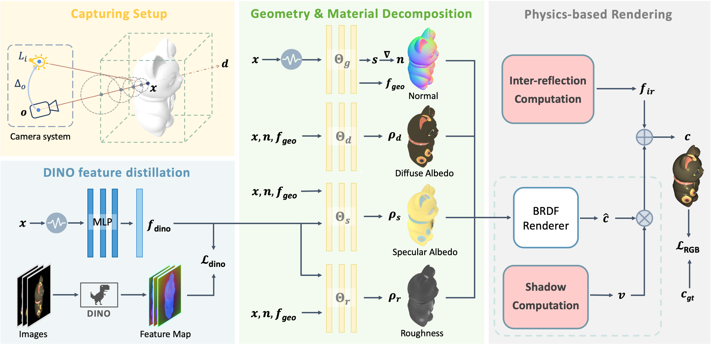

<h2 align="center"><a href="https://arxiv.org/abs/2408.06828">PIR: Photometric Inverse Rendering with Shading Cues Modeling and Surface Reflectance Regularization</a></h2>

[](https://jzbao03.site/projects/PIR/)
[](https://arxiv.org/abs/2408.06828) 
[](https://static.jzbao03.site/projects/pir/videos/supp_video.1080p.H265.30fps(1.8).crf18.mp4)
[](https://opensource.org/license/bsd-2-clause)


The official implementation of paper "PIR: Photometric Inverse Rendering with Shading Modeling and Surface Reflectance Regularization". We propose a framework that jointly accounts for self-shadows, indirect illumination and material decomposition. To enhance surface reflectance decomposition, we introduce a new regularization by distilling DINO features to foster accurate and consistent material decomposition.





## TODO

- [x] Technical Report
- [x] Release Code
- [x] Release Dataset Rendering Code
- [ ] This repo is still under construction. The code will be refactored for better use.


## Get Started

You may follow the next steps to use `PIR`.

```bash
git clone https://github.com/ZqlwMatt/PIR
cd PIR
conda create -n pir python=3.10 && conda activate pir
```

### Install Requirements

First install [Pytorch](https://pytorch.org/get-started/locally/) by your CUDA version:

```bash
pip install torch torchvision torchaudio --index-url https://download.pytorch.org/whl/cu121
```

Then install the other requirements via:

```bash
pip install -r requirements.txt
pip install tensorboard kornia
conda install -c conda-forge igl
```

## Training

We have tested the training process in Ubuntu 22.04.5 with a RTX3090. We provide training and evaluation scripts in the folder `scripts`. You should modify the `data_dir` to your data folder. Please see `Dataset` section to download and prepare the dataset.

```bash
sh scripts/train_vis.sh
sh scripts/eval_vis.sh
```

The training contains 3 stages:
  1. Volume rendering to initialize the geometry (SDF) and diffuse albedo network;
  2. Initialize DINO features and Optimize the offset (save visibility map);
  3. Optimize PBR materials.

We have set up a few network warmup tricks to stabilize the training, and you can refer to the code for details.

For mesh evaluation, you can `src/eval_mesh.py` to calculate the Chamfer distance.

## Dataset

### Synthetic data generation with a point light

The default camera is collocated with the point light. You should add an offset to the light source. Check `mitsuba/render_rgb_flabh_mat.py` for details, or you can use our rendered dataset via [Google Drive](https://drive.google.com/drive/folders/1WzRbahZVbapuMRGkc9vCbxbPh87dqqq7?usp=sharing).

Note that you should have Mitsuba installed, you can use this [Dockerfile](https://github.com/Traverse-Research/mitsuba-conda-docker) to set up the environment.

### Relight the 3D assets using envmaps

Check `mitsuba/render_rgb_envmap_mat.py`.

### Camera parameters convention

We use the OpenCV camera convention just like [NeRF++](https://github.com/Kai-46/nerfplusplus); you might want to use the camera visualization and debugging tools in that codebase to inspect if there's any issue with the camera parameters. Note we also assume the objects are inside the unit sphere.

## Results

Please refer to our [website](https://jzbao03.site/projects/PIR/) for more results and comparison. 

https://github.com/user-attachments/assets/0d5d7aac-0d86-49a2-be60-f32a0212bb2d


## Citation

```bibtex
@article{bao2024pir,
      title={PIR: Photometric Inverse Rendering with Shading Cues Modeling and Surface Reflectance Regularization},
      author={Jingzhi Bao and Guanying Chen and Shuguang Cui},
      journal={arXiv preprint arXiv:2408.06828},
      year={2024}
}
```


## Credits
This codebase is built upon the [IRON](https://github.com/Kai-46/IRON). Thanks to the authors for open-sourcing their projects. The shader is modified to approximately align with [Mitsuba](https://github.com/mitsuba-renderer/mitsuba) point emitter shader.
